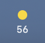
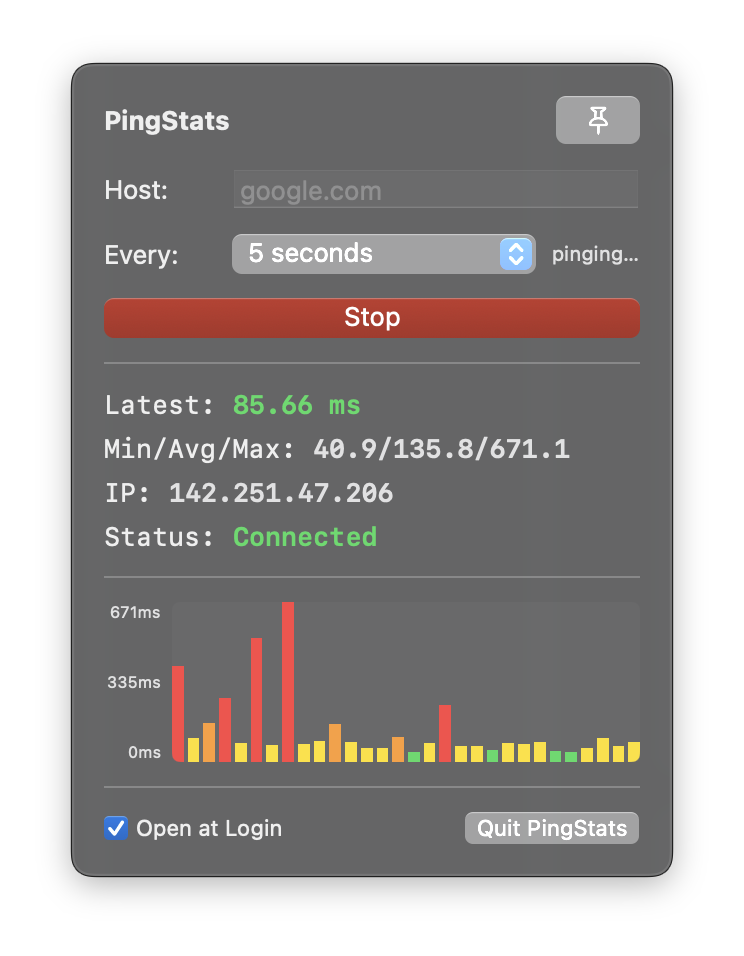

<div align="center">

# PingStats

**Live network latency on macOS and Windows.**

Glanceable RTT in your menu bar (macOS) / system tray (Windows) · rolling min/avg/max · pinable popup · open at login

[](#requirements)
[](#macos--build-from-source)
[](#windows)
[](#windows)
[](LICENSE)
[](#install)

<br />




<br />

**macOS** — Drag · Drop · Allow once. Release DMGs use the classic Applications layout.  
**Windows** — `dotnet build` from source, or grab a published zip from Releases.

</div>

---

## Features

| Feature | Description |
|---|---|
| **macOS menu bar** / **Windows tray** | Latest ping (ms) with color: green &lt;50 · yellow &lt;100 · orange &lt;200 · red ≥200 |
| **Popup** | Latest, min/avg/max, resolved IP, live bar graph |
| **Host** | Any IP or hostname (default `8.8.8.8`) |
| **Interval** | 1s / 2s / 5s / 10s / 30s (persisted) |
| **Pin** | Keep the popup open while you work elsewhere |
| **Open at Login** | System Login Items (macOS) / Registry Run key (Windows) |
| **Quiet** | No Dock icon (macOS) / system-tray-only (Windows) |

---

## Install

### DMG (recommended)

1. Download **`PingStats-*.dmg`** from the repo **Releases** page
2. Open the DMG → open **How to Open** (short guide + link)
3. Drag **PingStats** onto **Applications**
4. Open the app once (warning appears — click **Done**)
5. Use the guide’s **Open Privacy & Security** link (or System Settings → Privacy & Security)
6. Click **Open Anyway** for PingStats
7. Later opens work normally; optional: enable **Open at Login** in the popup

> Releases are **not** Apple-notarized (no Developer ID). On modern macOS the first launch  
> shows *“Apple could not verify…”* — that system dialog cannot be customized. Allowing the  
> app once under **Privacy & Security → Open Anyway** is the simple path (no scripts).

### macOS — Build from source

```bash
git clone <your-fork-or-repo-url>.git
cd pingstats
open src/macos/PingStats.xcodeproj
```

In Xcode: scheme **PingStats**, configuration **Release**, then **Product → Build** (⌘B).

Copy:

```text
~/Library/Developer/Xcode/DerivedData/PingStats-*/Build/Products/Release/PingStats.app
```

into `/Applications`.

### Windows — Build from source

```bash
git clone <your-fork-or-repo-url>.git
cd pingstats
dotnet build src/windows/PingStats.Windows/PingStats.Windows.csproj -c Release
```

The output binary will be at:

```text
src/windows/PingStats.Windows/bin/Release/net8.0-windows/PingStats.exe
```

Requires [.NET 8 SDK](https://dotnet.microsoft.com/en-us/download/dotnet/8.0) and Windows 10+.

---

## Usage

1. **Menu bar** — latest RTT + status color  
2. **Click icon** — popup with stats, graph, host & interval  
3. **Click outside** — dismiss (or use **pin** to keep open)  
4. **Stop → edit host → Start** — change target  
5. **Every** — change ping interval  
6. **Open at Login** — bottom-left checkbox  
7. **Quit PingStats** — bottom-right  

---

## How it works

### macOS

- Shells out to `/sbin/ping -c 1` and parses `time=… ms` (same numbers as Terminal)
- Menu bar shows the **latest** sample; popup keeps **min/avg/max** over the last 30 successes
- Sandbox is **off** so `ping` can run

### Windows

- Shells out to `ping -n 1` and parses `time<…ms` (same numbers as Command Prompt)
- System tray icon shows the **latest** sample; popup keeps **min/avg/max** over the last 30 successes
- No sandbox restrictions

Both platforms track the same stats and share the same feature set.

---

## Releases (DMG via GitHub Actions)

Pushing a version tag builds a **drag-to-Applications** DMG on `macos-14` and attaches it to a GitHub Release:

```bash
git tag v1.0.0
git push origin v1.0.0
```

Workflow: [`.github/workflows/release.yml`](.github/workflows/release.yml)

What you get in the DMG:

- `PingStats.app` (left) + shortcut to **Applications** (right)
- **How to Open.html** — first-open steps + link into Privacy & Security
- Custom Finder background (`assets/dmg-background.png`) via [`create-dmg`](https://github.com/create-dmg/create-dmg)

You can also run the workflow manually (**Actions → Release → Run workflow**) to produce an artifact without a tag.

Local DMG (on a Mac, after a Release build):

```bash
brew install create-dmg   # optional but prettier layout
./scripts/create-dmg.sh /path/to/PingStats.app dist/PingStats.dmg
```

---

## Project layout

```text
pingstats/
├── .github/workflows/
│   ├── ci.yml                      # Build and test workflow
│   └── release.yml                 # Release workflow
├── src/
│   ├── macos/
│   │   ├── PingStats/              # macOS app sources
│   │   │   ├── PingStatsApp.swift  # App, menu bar, popup UI, login item
│   │   │   ├── PingManager.swift   # Ping + stats
│   │   │   ├── Assets.xcassets/
│   │   │   ├── Info.plist
│   │   │   └── PingStats.entitlements
│   │   └── PingStats.xcodeproj/
│   └── windows/
│       └── PingStats.Windows/      # Windows app sources
│           ├── App.xaml(.cs)
│           ├── TrayManager.cs
│           ├── PingManager.cs
│           ├── PopupWindow.xaml(.cs)
│           └── PingStats.Windows.csproj
├── assets/
│   ├── dmg-background.png          # Finder window background (1x)
│   └── dmg-background@2x.png       # Retina source
│   └── screenshots/                # README images
│       ├── pingstats-icon.png      # Menu bar icon screenshot
│       └── pingstats-popup-ui.png  # Popup UI screenshot
├── scripts/
│   ├── create-dmg.sh               # DMG packager
│   └── How to Open.html            # First-open guide (staged into DMG)
├── CONTRIBUTING.md
├── LICENSE
├── README-INSTALL.md
├── README.md
└── SECURITY.md
```

---

## Credits

This project started from **[MenuPIng](https://github.com/NimbleAINinja/MenuPIng)** by **[NimbleAINinja](https://github.com/NimbleAINinja)** — thank you for the original menu bar ping app and structure.

PingStats continues that idea with UX and packaging changes (latest-in-menu-bar, interval control, pin, open-at-login, DMG releases, and related fixes).

---

## Requirements

### macOS

- macOS **13.0** or later  
- Xcode **15+** to build from source  

### Windows

- Windows **10** or later  
- [.NET 8 SDK](https://dotnet.microsoft.com/en-us/download/dotnet/8.0) to build from source  

---

## License

[MIT](LICENSE) — see the license file for full terms. Original MenuPIng work is credited above; this repository is also under MIT.
