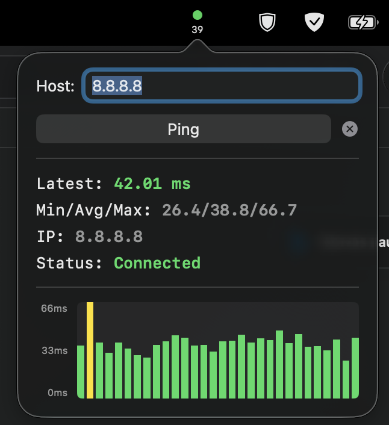

# PingMenuBar

A lightweight macOS menu bar application that continuously monitors network latency with real-time visual feedback.

## Features



### Menu Bar Icon
- **Dynamic colored indicator**: Shows current network status at a glance
  - 🟢 Green: < 50ms (excellent)
  - 🟡 Yellow: 50-100ms (good)
  - 🟠 Orange: 100-200ms (fair)
  - 🔴 Red: > 200ms (poor)
  - ⚪ Gray: Not connected
- **30-second rolling average**: Displays the average ping time over the last 30 seconds
- **Compact design**: Minimal space usage in your menu bar

### Popup Interface
- **Real-time statistics**: Latest ping, Min/Avg/Max over 30 seconds
- **DNS resolution**: Automatically resolves domain names to IP addresses
- **Live graph**: Visual history of the last 30 pings with color-coded bars
- **Connection status**: Clear indication of connectivity state
- **Custom host support**: Ping any hostname or IP address

### Auto-Start
- Automatically begins pinging 8.8.8.8 (Google DNS) on launch
- Runs silently in the background
- Hidden from Dock for a clean desktop experience

## Usage

### Basic Operation
1. **View status**: The menu bar icon shows your current network latency
2. **Open popup**: Click the icon to see detailed statistics and graph
3. **Change host**: Enter a different hostname or IP address and click "Ping"
4. **Stop pinging**: Click "Stop" to pause monitoring
5. **Quit**: Click the X button to exit the application

### Supported Hosts
- IP addresses: `8.8.8.8`, `1.1.1.1`, etc.
- Domain names: `google.com`, `github.com`, etc. (automatically resolved to IP)

## Installation

### Build from Source
1. Open `PingMenuBar.xcodeproj` in Xcode
2. Build the project (Cmd+B)
3. Run the app (Cmd+R)

### Launch on Startup (Optional)
Run the included installation script:
```bash
./install-launch-agent.sh
```

Or manually:
1. Build the app in Xcode
2. Copy `PingMenuBar.app` to your Applications folder
3. Go to **System Settings → General → Login Items**
4. Click **+** and add PingMenuBar

## Technical Details

- **Ping method**: Uses `/sbin/ping` via Process execution
- **Update frequency**: Every 1 second
- **History**: Stores last 30 ping results (30 seconds)
- **DNS resolution**: Uses `getaddrinfo` for hostname lookup
- **Sandbox**: Disabled to allow ping execution
- **Requirements**: macOS 13.0+

## Project Structure

```
PingMenuBar/
├── PingMenuBarApp.swift      # Main app & menu bar icon rendering
├── ContentView.swift          # Popup UI & graph visualization
├── PingManager.swift          # Ping logic & DNS resolution
├── Info.plist                 # App configuration
└── Assets.xcassets/           # App assets
```

## Uninstalling Auto-Launch

If you used the install script:
```bash
launchctl unload ~/Library/LaunchAgents/com.example.PingMenuBar.plist
rm ~/Library/LaunchAgents/com.example.PingMenuBar.plist
```

Or via System Settings:
- **System Settings → General → Login Items**
- Select PingMenuBar and click **-**

## License

[](https://opensource.org/licenses/MIT)

This project is licensed under the MIT License - see the [LICENSE](LICENSE) file for details.

